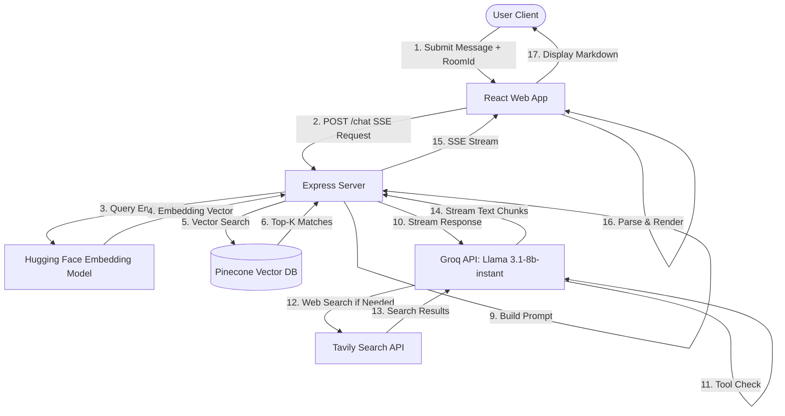

# Jodo.AI 🤖

Jodo.AI is an advanced, responsive AI-powered personal assistant that combines **Retrieval-Augmented Generation (RAG)** with dynamic **Tool Calling** (real-time web search) and streams answers using **Server-Sent Events (SSE)**.

It is structured as a monorepo containing a modern React frontend and a robust Node.js backend.

---

## Key Features

- **Retrieval-Augmented Generation (RAG)**: Ingests documents (PDFs) locally, computes embeddings using Hugging Face's `all-MiniLM-L6-v2` model, stores them in a Pinecone vector database, and queries them to answer questions with contextual accuracy.
- **Dynamic Tool Calling**: Uses the Tavily Search API to execute real-time web searches silently if the local document context is insufficient or if up-to-date internet knowledge is required.
- **Server-Sent Events (SSE) Streaming**: Delivers answers token-by-token for a smooth, conversational, and instant user experience.
- **Modern React Chat Interface**: Beautiful dark-themed React 19 web app featuring markdown rendering, syntax highlighting for code snippets, a clean input area, and responsive layouts styled with Tailwind CSS v4.
- **Intelligent LLM Broker**: Powered by Groq's high-speed `llama-3.1-8b-instant` model.

---

## Tech Stack

### Frontend (`/frontend`)
*   **Framework**: React 19 & Vite
*   **Styling**: Tailwind CSS v4
*   **Markdown Rendering**: `react-markdown`
*   **Network Requests**: Native Fetch (SSE reading) and Axios

### Backend / Agent Service (`/toolcalling`)
*   **Server**: Express.js
*   **Orchestration & Splitting**: LangChain (`@langchain/core`, `@langchain/community`, `@langchain/textsplitters`)
*   **Embeddings**: Hugging Face Transformers (`@huggingface/transformers` running `Xenova/all-MiniLM-L6-v2` locally)
*   **Vector Database**: Pinecone Database
*   **LLM Provider**: Groq SDK (`llama-3.1-8b-instant`)
*   **Search Tool**: Tavily Core API
*   **Memory**: Node-Cache (temporary session cache mapping messages to room IDs)

## Architecture Layers

### Layer 1: Frontend UI (`/frontend`)
- React 19 component-based interface
- Real-time SSE stream parsing
- Markdown rendering with syntax highlighting
- Message history state management
- Room ID session tracking

### Layer 2: API Gateway (`/toolcalling/server.js`)
- Express HTTP server
- CORS middleware for cross-origin requests
- SSE stream setup and management
- Request validation
- Error handling & logging

### Layer 3: Orchestration Engine (`/toolcalling/index.js`)
- Coordinates all retrieval and generation steps
- Manages embedding generation
- Orchestrates hybrid search (vector + keyword)
- Reranking pipeline
- LLM prompt construction
- Tool calling decision logic

### Layer 4: Data Retrieval (`/toolcalling/`)
- **Vector Search**: Pinecone database queries
- **Keyword Search**: In-memory BM25 index
- **Reranking**: Cross-encoder scoring
- **Caching**: Redis session & RAG cache

### Layer 5: LLM & Tools
- **Groq API**: Main inference engine (Llama 3.1-8b-instant)
- **Tavily API**: Real-time web search tool
- **Hugging Face**: Embedding model (Xenova)

### Layer 6: Data Storage
- **Pinecone**: Vector embeddings index
- **Redis**: Session cache & conversation history

---

## Data Flow Diagram (Simplified)

```
User Input
    ↓
Frontend (React App)
    ↓
HTTP POST /chat (message, roomId)
    ↓
Express Server (server.js)
    ↓
Orchestration (index.js)
    ├→ Generate Query Embedding (HF Model)
    ├→ Vector Search (Pinecone)
    ├→ Keyword Search (BM25)
    ├→ Merge & Rerank Results
    └→ Build System Prompt
    ↓
Call Groq LLM
    ├→ Check if web search needed
    └→ If yes → Call Tavily API
    ↓
Stream Response via SSE
    ↓
Frontend Parses & Renders Markdown
    ↓
Display to User
```

---

## Key Design Decisions

### Why Hybrid Search (Vector + BM25)?
- **Vector Search**: Captures semantic meaning (e.g., "salary" ≈ "compensation")
- **BM25 Search**: Captures exact terminology (e.g., "401k", "PTO days")
- **Combined**: Prevents missing relevant documents due to either approach alone

### Why Reranking?
- Initial retrieval returns 20+ candidates
- Reranker uses semantic cross-encoder to score actual relevance
- Dramatically improves top-5 quality without extra compute

### Why Local Embeddings?
- Running Hugging Face embeddings locally eliminates API calls
- Reduces latency and cost
- No sensitive data sent to external services

### Why SSE Streaming?
- Token-by-token streaming shows responsiveness immediately
- Better UX than waiting for complete response
- Reduces perceived latency

### Why Tool Calling for Web Search?
- LLM decides autonomously if web search is needed
- Balances RAG context with current information
- Reduces unnecessary API calls

---

## Prerequisites

Ensure you have the following installed on your machine:
*   [Node.js](https://nodejs.org/) (v18.x or higher)
*   [npm](https://www.npmjs.com/) (usually bundled with Node.js)

---

## Project Setup & Configuration

### 1. Environment Configuration

Navigate to the `toolcalling` directory and locate/create a `.env` file to configure your credentials:

```bash
cd toolcalling
```

Add the following keys to your `.env` file:

```env
# Groq API Key for LLM Inference (https://console.groq.com/)
GROQ_API_KEY="your_groq_api_key_here"

# Tavily API Key for Web Search Tool (https://tavily.com/)
TAVILY_API_KEY="your_tavily_api_key_here"

# Pinecone Database Credentials for RAG (https://www.pinecone.io/)
PINECONE_API_KEY="your_pinecone_api_key_here"
PINECONE_INDEX_NAME="your_pinecone_index_name_here"
```

---

## Quick Start Setup

### Step 1: Backend Setup

#### 1.1 Install Dependencies
```bash
cd toolcalling
npm install
```
This installs all required packages including Express, Groq SDK, Pinecone client, Hugging Face embeddings, and Tavily API.

#### 1.2 Initialize BM25 Index (First Run Only)
When the backend starts for the first time, it automatically:
- Loads all chunks from Pinecone across configured namespaces
- Builds an in-memory BM25 index for keyword search
- Logs: `"BM25 index initialized with X chunks"`

#### 1.3 Ingest PDF Documents (Optional but Recommended)
If you want to add documents to Jodo.AI's knowledge base:

1. Place your PDF file in the `toolcalling` directory
2. Update `ready_pdfs.js` to include your PDF filename
3. Run ingestion script:
   ```bash
   node -e "import('./ingestion_step.js').then(m => m.fileload('./your-document.pdf'))"
   ```
4. After ingestion completes, flush the RAG cache (see below)

#### 1.4 Flush RAG Cache After Ingestion
After indexing new PDFs, clear the cached results so they're included in future searches:
```bash
curl -X POST http://localhost:3001/flush-rag-cache
```

#### 1.5 Start the Backend Server
```bash
node server.js
```
Expected output:
```
Server running on port 3001
BM25 index initialized with [N] chunks
```

Backend is now ready at `http://localhost:3001`

### Step 2: Frontend Setup

#### 2.1 Install Dependencies
```bash
cd frontend
npm install
```

#### 2.2 Configure Backend Endpoint
The frontend needs to know where the backend is running.

**For Local Development:**
Open `frontend/src/App.jsx` and modify line 28:
```javascript
// Change from:
const response = await fetch('https://jodo-ai.onrender.com/chat', {

// To:
const response = await fetch('http://localhost:3001/chat', {
```

**For Production:**
Leave it pointing to your production server URL (e.g., `https://jodo-ai.onrender.com/chat`)

#### 2.3 Start the Development Server
```bash
npm run dev
```

Vite will output:
```
Local: http://localhost:5173/
```

#### 2.4 Open in Browser
Visit `http://localhost:5173/` to start chatting with Jodo.AI

---

## Testing the Setup

### Test 1: Backend Health Check
```bash
curl http://localhost:3001/
```
Expected: `hello how can i assist you`

### Test 2: Ask a Question (RAG Test)
```bash
curl -X POST http://localhost:3001/chat \
  -H "Content-Type: application/json" \
  -d '{
    "message": "What is the company policy?",
    "roomId": "test-room-123"
  }'
```

### Test 3: Clear Conversation
```bash
curl -X POST http://localhost:3001/clear \
  -H "Content-Type: application/json" \
  -d '{ "roomId": "test-room-123" }'
```

---

## Troubleshooting Setup Issues

| Issue | Solution |
|-------|----------|
| `Cannot find module 'groq-sdk'` | Run `npm install` in `/toolcalling` |
| `GROQ_API_KEY not found` | Ensure `.env` file exists with all required keys |
| `Pinecone connection error` | Check API key, network connection, and index name |
| `Embedding model download fails` | Ensure internet connection; model auto-downloads on first use |
| `Frontend can't connect to backend` | Verify backend is running on port 3001, CORS is enabled |
| `Old documents still showing` | Run `/flush-rag-cache` endpoint after ingesting new PDFs |

---

## How It Works (System Architecture)

### Detailed Request Flow



### Step-by-Step Process Breakdown

#### Step 1: User Input & Room Creation
- User types a question in the React chat interface
- A unique **roomId** is generated (timestamp + random hash) to track conversation state
- User message is sent to backend via POST `/chat` endpoint

#### Step 2: Message Ingestion
- Express server receives message and roomId
- Sets SSE headers for streaming response
- Initializes response stream with `Content-Type: text/event-stream`

#### Step 3: Query Embedding Generation
- Backend converts user question into a dense vector using Hugging Face's offline embedding model
- Model used: `Xenova/all-MiniLM-L6-v2` (runs locally for zero latency)
- Returns 384-dimensional embedding vector

#### Step 4: Hybrid Search Retrieval (Vector + Keyword)
**Vector Search (Semantic):**
- Query embedding is sent to Pinecone vector database
- Searches across configured namespaces (e.g., `essentr-policy`)
- Returns top-20 matches with similarity scores (filtered > 0.3)

**BM25 Keyword Search (Exact Match):**
- In-parallel, performs keyword/lexical search using BM25 algorithm
- Searches pre-loaded in-memory chunks from Pinecone
- Captures keyword matches that vector search might miss

#### Step 5: Results Merging & Reranking
- Combines vector and BM25 results with weighted scoring
- Reranks merged results using cross-encoder model (Sentence-Transformers)
- Returns top-5 most relevant chunks with reranker scores
- Filters out low-confidence results (score < 0.1) if insufficient context

#### Step 6: Context-Aware Prompt Construction
- If relevant context found: embeds document chunks into system prompt
- Instructs LLM to answer based on provided context
- If no context found: marks as "general knowledge" question
- Includes formatting instructions (markdown, code blocks, etc.)

#### Step 7: LLM Generation with Tool Calling
- Backend calls Groq API (llama-3.1-8b-instant) with constructed prompt
- Groq processes and determines if:
  - **Question answerable from context**: Returns direct answer
  - **Question requires current info**: Calls `tavily_search` tool automatically
  - **Hybrid approach needed**: Combines context + web results

#### Step 8: Web Search (Conditional)
- If Groq decides web search is needed, Tavily API is called
- Fetches real-time web results with configurable number of results
- Results are returned to Groq and combined with prompt context
- Groq regenerates final answer with fresh information

#### Step 9: Streaming Response
- Groq streams response token-by-token back to Express server
- Each chunk is wrapped in SSE format: `data: {chunk}\n\n`
- Express forwards chunks to React frontend in real-time

#### Step 10: Frontend Parsing & Rendering
- React app reads SSE stream and parses JSON chunks
- Appends chunks to conversation state incrementally
- Renders markdown (via `react-markdown`) with:
  - Syntax highlighting for code blocks
  - Formatted headings, lists, and tables
  - Proper line breaks and spacing

#### Step 11: Conversation Persistence (Optional)
- Conversation history can be cached in Redis by roomId
- Allows multi-turn context awareness
- Prevents need to re-index same documents per message

---

## Core Components & Responsibilities

### Backend Components (`/toolcalling`)

| Component | Purpose |
|-----------|---------|
| `server.js` | Express server, HTTP handlers, SSE stream setup |
| `index.js` | Main orchestration: retrieval → LLM → streaming |
| `hybridsearch.js` | Merges vector + BM25 keyword results |
| `reranker.js` | Cross-encoder reranking for top results |
| `loadallchunks.js` | Loads all Pinecone chunks for BM25 indexing |
| `ingestion_step.js` | PDF ingestion: parse → embed → index in Pinecone |
| `redis.js` | Session cache & conversation persistence |

### Frontend Components (`/frontend/src`)

| Component | Purpose |
|-----------|---------|
| `App.jsx` | Main chat UI, SSE stream reader, message display |
| `App.jsx` → `generate()` | Handles chat POST request & chunk streaming |
| `react-markdown` | Renders markdown in AI responses |

### External Services

| Service | Role | API |
|---------|------|-----|
| **Groq** | LLM inference engine | llama-3.1-8b-instant |
| **Pinecone** | Vector database for embeddings | REST API |
| **Tavily** | Real-time web search | Tavily Core API |
| **Hugging Face** | Embedding model (runs locally) | `Xenova/all-MiniLM-L6-v2` |
| **Redis** | Session & RAG result caching | In-memory data store |

---

## API Endpoints

### POST `/chat`
Submits a user message and streams the AI response.

**Request:**
```json
{
  "message": "What is the company policy?",
  "roomId": "abc123xyz789"
}
```

**Response (SSE Stream):**
```
data: {"chunk": "The company policy covers..."}

data: {"chunk": " employee benefits..."}

data: [DONE]
```

### POST `/clear`
Clears conversation history for a specific roomId.

**Request:**
```json
{
  "roomId": "abc123xyz789"
}
```

**Response:**
```json
{ "message": "Conversation cleared" }
```

### POST `/flush-rag-cache`
Clears all cached RAG results (run after indexing new PDFs).

**Response:**
```json
{ "message": "RAG cache cleared" }
```

### GET `/`
Health check endpoint.

**Response:**
```
hello how can i assist you
```

---

## Environment Variables Reference

### Required Variables

```env
# Groq API Key
# Get from: https://console.groq.com/
GROQ_API_KEY=gsk_xxxxxxxxxxxxxxxxxxxxxxxxxxxxxxxx

# Tavily Search API Key
# Get from: https://tavily.com/
TAVILY_API_KEY=tvly_xxxxxxxxxxxxxxxxxxxxxxxxxxxxxxxx

# Pinecone Vector Database
# Get from: https://www.pinecone.io/
PINECONE_API_KEY=xxxxx-xxxxx-xxxxx-xxxxx-xxxxx
PINECONE_INDEX_NAME=your-index-name

# Redis Connection (for caching)
# Optional - defaults to localhost:6379
REDIS_URL=redis://localhost:6379
```

### Optional Variables

```env
# Groq Model Selection
GROQ_MODEL=llama-3.3-70b-versatile

# Embedding Model
HF_MODEL=Xenova/all-MiniLM-L6-v2

# Tavily Search Results Count
TAVILY_TOP_K=5

# RAG Cache TTL (seconds)
RAG_CACHE_TTL=3600

# Server Configuration
PORT=3001
HOST=0.0.0.0
```

---

## Performance Tuning

### Retrieval Performance
- **Vector Search**: Adjust `topK` parameter in `index.js` (default: 20)
- **Reranker**: Tune `rerankerScore` threshold (default: 0.1)
- **BM25**: Modify `topK` for hybrid merge (default: 20)

### Response Latency
| Component | Typical Latency |
|-----------|-----------------|
| Embedding Generation | 100-200ms (local) |
| Vector Search | 50-200ms |
| Reranking | 200-500ms |
| LLM Generation | 2-10s (streaming) |
| Web Search | 1-3s (if needed) |
| **Total** | **3-15s** (end-to-end) |

### Optimization Tips
1. **Reduce vector search latency**: Use Pinecone's pod size (`s1`, `p1`, `p2`)
2. **Reduce reranking time**: Lower `topK` in reranker

---

## Deployment Guide

### Deploy to Render (Backend)

1. Push code to GitHub repository
2. Create new Web Service on Render
3. Set environment variables:
   ```
   GROQ_API_KEY=xxx
   TAVILY_API_KEY=xxx
   PINECONE_API_KEY=xxx
   PINECONE_INDEX_NAME=xxx
   REDIS_URL=xxx (from Render Redis add-on)
   ```
4. Build command: `npm install`
5. Start command: `node server.js`

### Deploy to Vercel (Frontend)

1. Update backend URL in `App.jsx` to production endpoint
2. Push to GitHub
3. Connect repo to Vercel
4. Deploy (auto-deploys on push)

### Environment-Specific Configuration

**Development** (`localhost:5173`):
```javascript
const BACKEND_URL = 'http://localhost:3001/chat'
```

**Production** (`vercel-domain.com`):
```javascript
const BACKEND_URL = 'https://jodo-ai.onrender.com/chat'
```

---

## Contributing & Development

### Adding New Document Namespaces
1. Create new Pinecone namespace in `index.js`:
   ```javascript
   const namespaces = [
       'essentr-policy',
       'your-new-namespace',  // Add here
   ];
   ```
2. Ingest documents to new namespace
3. Restart backend (BM25 rebuilds automatically)

### Customizing LLM Behavior
Edit system prompt in `index.js`:
```javascript
const systemPrompt = `You are Jodo.AI, a helpful assistant...`
```

### Changing Search Strategy
- **Vector-only**: Comment out BM25 merge in `index.js`
- **Keyword-only**: Skip Pinecone vector search
- **Custom reranking**: Implement in `reranker.js`

---

## License & Support

For issues, questions, or contributions, please reach out or submit a GitHub issue.

---
