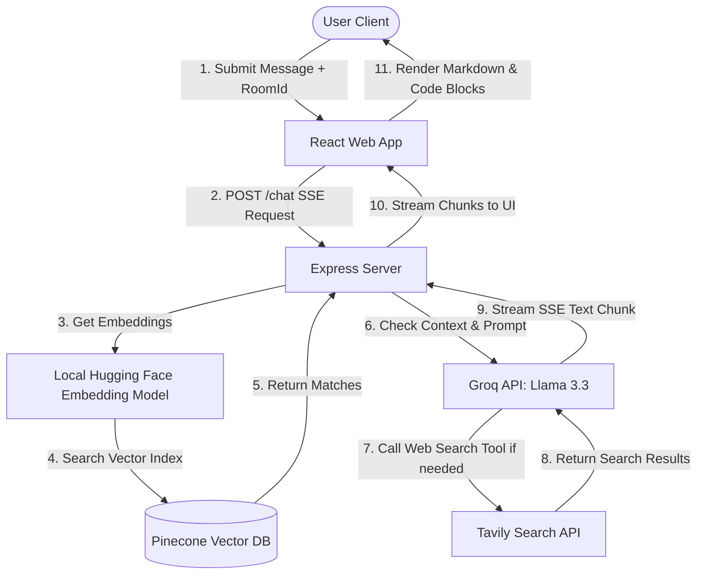

# Jodo.AI 🤖

Jodo.AI is an advanced, responsive AI-powered personal assistant that combines **Retrieval-Augmented Generation (RAG)** with dynamic **Tool Calling** (real-time web search) and streams answers using **Server-Sent Events (SSE)**.

It is structured as a monorepo containing a modern React frontend and a robust Node.js backend.

---

## Key Features

- **Retrieval-Augmented Generation (RAG)**: Ingests documents (PDFs) locally, computes embeddings using Hugging Face's `all-MiniLM-L6-v2` model, stores them in a Pinecone vector database, and queries them to answer questions with contextual accuracy.
- **Dynamic Tool Calling**: Uses the Tavily Search API to execute real-time web searches silently if the local document context is insufficient or if up-to-date internet knowledge is required.
- **Server-Sent Events (SSE) Streaming**: Delivers answers token-by-token for a smooth, conversational, and instant user experience.
- **Modern React Chat Interface**: Beautiful dark-themed React 19 web app featuring markdown rendering, syntax highlighting for code snippets, a clean input area, and responsive layouts styled with Tailwind CSS v4.
- **Intelligent LLM Broker**: Powered by Groq's high-speed `llama-3.3-70b-versatile` model.

---

## Tech Stack

### Frontend (`/frontend`)
*   **Framework**: React 19 & Vite
*   **Styling**: Tailwind CSS v4
*   **Markdown Rendering**: `react-markdown`
*   **Network Requests**: Native Fetch (SSE reading) and Axios

### Backend / Agent Service (`/toolcalling`)
*   **Server**: Express.js
*   **Orchestration & Splitting**: LangChain (`@langchain/core`, `@langchain/community`, `@langchain/textsplitters`)
*   **Embeddings**: Hugging Face Transformers (`@huggingface/transformers` running `Xenova/all-MiniLM-L6-v2` locally)
*   **Vector Database**: Pinecone Database
*   **LLM Provider**: Groq SDK (`llama-3.3-70b-versatile`)
*   **Search Tool**: Tavily Core API
*   **Memory**: Node-Cache (temporary session cache mapping messages to room IDs)

---

## Prerequisites

Ensure you have the following installed on your machine:
*   [Node.js](https://nodejs.org/) (v18.x or higher)
*   [npm](https://www.npmjs.com/) (usually bundled with Node.js)

---

## Project Setup & Configuration

### 1. Environment Configuration

Navigate to the `toolcalling` directory and locate/create a `.env` file to configure your credentials:

```bash
cd toolcalling
```

Add the following keys to your `.env` file:

```env
# Groq API Key for LLM Inference (https://console.groq.com/)
GROQ_API_KEY="your_groq_api_key_here"

# Tavily API Key for Web Search Tool (https://tavily.com/)
TAVILY_API_KEY="your_tavily_api_key_here"

# Pinecone Database Credentials for RAG (https://www.pinecone.io/)
PINECONE_API_KEY="your_pinecone_api_key_here"
PINECONE_INDEX_NAME="your_pinecone_index_name_here"
```

---

## Quick Start Setup

### Step A: Start the Backend Server

1. Navigate to the backend directory:
   ```bash
   cd toolcalling
   ```
2. Install the backend dependencies:
   ```bash
   npm install
   ```
3. *(Optional)* Ingest a PDF document into Pinecone:
   Place your PDF file (e.g., `ESSentr_Company_Policy_Document.pdf`) in the `toolcalling` folder and execute the ingestion script:
   ```bash
   node -e "import('./ingestion_step.js').then(m => m.fileload('./ESSentr_Company_Policy_Document.pdf'))"
   ```
4. Start the Express server:
   ```bash
   node server.js
   ```
   The backend will start running at `http://localhost:3001`.

### Step B: Start the Frontend Application

1. Open a new terminal window and navigate to the frontend directory:
   ```bash
   cd frontend
   ```
2. Install the frontend dependencies:
   ```bash
   npm install
   ```
3. **Local Dev Routing**: By default, the frontend code in [`App.jsx`](file:///c:/Users/divyanshu/OneDrive/Desktop/Jodo.AI/frontend/src/App.jsx#L25) requests the production/hosted server endpoint (`https://jodo-ai.onrender.com/chat`). If you want to connect to your local backend server, modify line 25 of `frontend/src/App.jsx` to:
   ```javascript
   const response = await fetch('http://localhost:3001/chat', {
   ```
4. Start the Vite development server:
   ```bash
   npm run dev
   ```
5. Open your browser and navigate to the provided local URL (usually `http://localhost:5173`).

---

## How It Works (System Architecture)



1. **User Interaction**: The user enters a question in the React app.
2. **Context Retrieval (RAG)**: The backend automatically generates a query embedding from the user's message using the offline Hugging Face model and queries Pinecone to find relevant document chunks.
3. **Prompt Composition**: A system prompt is built dynamically incorporating the relevant document context (if any) and instructing Jodo.AI on its output styling.
4. **Execution Loop & Tooling**: The backend uses Groq to decide if a web search is required to supplement the prompt (via Tavily). If needed, it calls the search function, appends the result to the context, and proceeds.
5. **Streaming Output**: The response is streamed to the user via SSE as it is generated by Groq.

---
